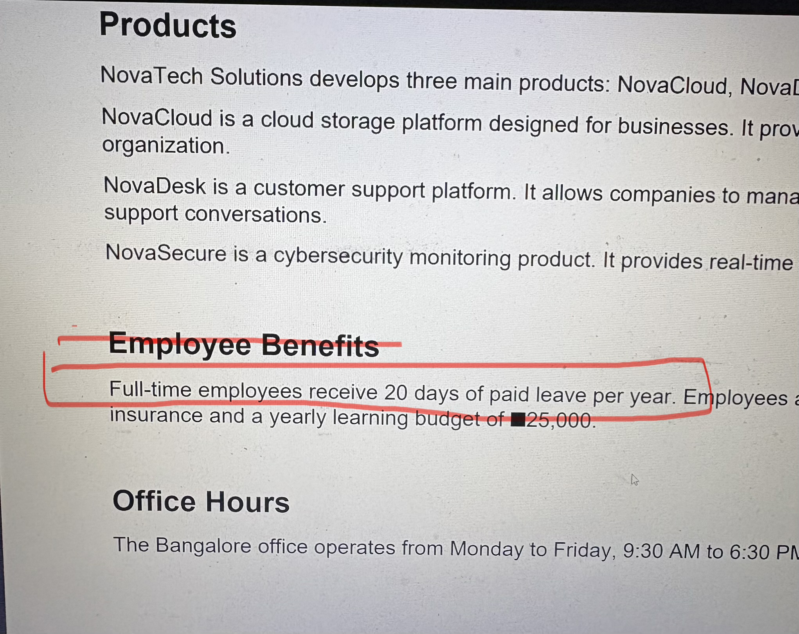

# AI-Knowledge-Base-Assistant

Upload a PDF → the application processes it → creates embeddings → stores them in ChromaDB → retrieves relevant information → Gemini LLM generates an answer.

ARCHITECTURE:-
   
  PDF
  ➡️
LangChain Document Loader
  ➡️
Text Splitter
  ➡️
Gemini Embeddings
  ➡️
ChromaDB
  ➡️
User Question
  ➡️
Query Embedding
  ➡️
Similarity Search
  ➡️
Relevant Chunks
  ➡️
Gemini LLM
  ➡️
Answer

Tech Stack:-                                        
                          
React + TypeScript
Node.js + Express
LangChain
Google Gemini API
Gemini Embeddings
ChromaDB
Docker
Axios

